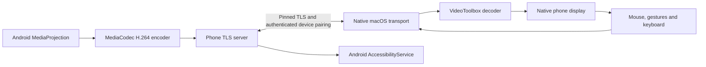

# Redmi Mirroring architecture and limits

This is a native macOS app and a cooperating Android companion. It does not embed a scrcpy window or depend on ADB for ordinary mirroring. ADB was used as a development and QA connection with the attached phone.

## Data path

Capture, control, discovery, identity, transport, and presentation are separate components. The companion runs a visible foreground service; its encoder surface receives the real display through MediaProjection. Video, optional playback audio, and commands use bounded framed messages. The Mac decodes H.264 through VideoToolbox and renders inside an AppKit/SwiftUI window. Queues avoid unlimited video buffering; a dropped sequence requests a fresh keyframe. Rotation detaches the virtual display's old encoder surface before replacing it. The encoder requests one-frame latency and caps surface-input frame rate; the actual Redmi readback was three frames, so the requested latency is not treated as an achieved value. Audio uses the player render clock to bound queue growth, with an adaptive 80–120 ms startup cushion and 240 ms cap.

Live pointer strokes preserve movement before release. Native trackpad scrolling sends Down/Move immediately and continues the same touch with coalesced updates at most 60 times per second, then releases after a 48 ms end grace or 120 ms idle fallback. This avoids replacing each scroll event with a separate Android swipe. Cancellation/reset releases a held pointer. A 1,250 ms phone watchdog releases a stale touch when Mac updates stop; a physical test verified holding beyond four seconds and watchdog release while only the Mac app was suspended. Optional bounded timing reports contain software stage timestamps, with no input coordinates, text, pairing credentials, or screen content.

Bonjour/Android NSD announces connection candidates. Discovery never grants access. Initial pairing uses a short-lived invitation containing the phone certificate fingerprint and a random secret, followed by approval on the phone. Subsequent sessions authenticate using the approved client identity and secret over certificate-pinned TLS. Pairing credentials and remote room settings are stored in macOS Keychain; Android private keys and encrypted credential storage use Android Keystore. Revocation closes or rejects the client's authenticated sessions. [Android NSD](https://developer.android.com/develop/connectivity/wifi/use-nsd), [Android Keystore](https://developer.android.com/privacy-and-security/keystore)

## Remote path

Both native bridges can initiate outbound TLS connections to an explicitly configured, self-hosted broker. Its random 256-bit room token admits opposite phone/Mac roles to an opaque byte tunnel. The Mac then establishes the **original phone TLS session inside that tunnel**, preserving the phone fingerprint and pairing credential. The broker cannot decrypt screen/audio/control data, although it observes relay admission, network addresses, timing, and traffic sizes. The Mac bridge listens strictly on loopback; the phone bridge connects to its own loopback TLS server. ADB is never exposed by this transport.

This release implements a TCP relay fallback. WebRTC ICE/STUN/TURN and direct remote P2P negotiation are not implemented. Real NAT traversal requires reachable signaling/relay infrastructure; local discovery alone cannot provide it. No external service, account, or paid deployment has been created. See `relay/README.md` for provisioning and bounded server limits. [WebRTC connectivity model](https://webrtc.org/getting-started/peer-connections)

## Platform boundaries

- **Capture permission:** target Android 14+ requires fresh consent for each new MediaProjection session. An existing projection can survive a network reconnect; a stopped projection cannot reuse the token. Rotation must resize the existing virtual display. Android 15 QPR1+ stops projection on screen lock. Remote access cannot restore expired consent or bypass lock-screen authentication. [MediaProjection](https://developer.android.com/media/grow/media-projection)
- **Restart/background:** target Android 15+ cannot launch a projection foreground service from boot completion. Android recorded HyperOS GarbageClean/OneKeyClean system kills during development; the cleaner's manual or automatic trigger is unknown, and no Java exception was established. One kill left Accessibility enabled but unbound, requiring owner-assisted recovery while video/audio recovered. Review Battery saver → No restrictions/Unrestricted and Background autostart, and avoid clearing the companion during mirroring. A Recents lock is optional only if the firmware exposes it; Xiaomi's Redmi 14C FAQ says background app lock is unsupported. Standard Android Doze exemption alone does not establish protection from these vendor kills. These settings cannot guarantee survival after force-stop, reboot, or memory pressure. [Foreground services](https://developer.android.com/develop/background-work/services/fgs/service-types), [Xiaomi autostart](https://dev.mi.com/xiaomihyperos/documentation/detail?pId=1624), [Redmi 14C FAQ](https://www.mi.com/pk/support/faq/details/KA-426105/)
- **Control:** AccessibilityService supplies supported gestures/global actions. API33+ accessibility input connections provide text insertion and editor operations; arbitrary system-wide event injection is not an ordinary-app privilege. Custom or protected editors may reject input. [AccessibilityService](https://developer.android.com/reference/android/accessibilityservice/AccessibilityService), [text input](https://developer.android.com/reference/android/accessibilityservice/InputMethod.AccessibilityInputConnection)
- **Audio/clipboard:** playback capture requires permission and source-app capture eligibility. Calls and protected audio are not universally available. Android10+ restricts background clipboard reads, so clipboard sharing is explicit. [Audio capture](https://developer.android.com/media/platform/av-capture), [clipboard limits](https://developer.android.com/about/versions/10/privacy/changes)
- **Screen off:** ordinary no-root APIs do not supply Apple's locked-phone mirroring integration. The lock shortcut locks the phone safely; this release does not promise capture while the physical display is off or securely locked.

## Evidence at the 2026-10-02 checkpoint

| Category | Evidence |
|---|---|
| **WORKING — real Redmi** | LAN portrait 720 × 1640 and landscape 1640 × 720 streaming, hardware Mac decoding, live pointer movement before release, held-touch watchdog recovery, Unicode text/Mac clipboard paste, scrolling, resizing, screenshot, exact-byte file transfer, Mac relaunch, and controlled TCP reconnection were verified. The latest continuous-scroll Settings test had 17 completed movements and no rejected segments; the user confirmed that it now responds well. Audio buffering fixes produced user-confirmed continuous clean playback, followed by a 30-second animation/audio run with control active throughout. Current Responsive 560 × 1280 ↔ 1280 × 560 rotation passed. Owner-assisted Accessibility recovery restored control after the system kill; authorized No restrictions/autostart settings were verified. The installed APK was byte-verified against delivery. Test-by-test scope is recorded in the report. |
| **WORKING — transport QA fixture** | Relay suite passed 13 genuine TLS/security cases. Actual Swift bridge passed nested TLS echo, reconnect, and rejection of both wrong relay and wrong phone fingerprints. The native eight-second stalled-connection deadline followed by reconnect to the real phone passed. These fixtures are not a substitute for Redmi remote tests. |
| **IMPLEMENTED BUT UNVERIFIED** | Internet relay operation, separate-network performance, unattended HyperOS persistence, Android-to-Mac clipboard, remaining shortcuts, Mac sleep/wake and lock lifecycle, long-duration quality, and remaining regression cases are open. [TEST-REPORT.md](TEST-REPORT.md) records current evidence. |
| **BLOCKED / PLATFORM LIMITATION** | Reusing expired capture consent, bypassing a secure phone lock, unrestricted protected audio capture, and continuous background clipboard reads in an ordinary companion. |

Network RTT and decoder duration are measured diagnostics. They do not equal glass-to-glass video latency. The final 30.004-second physical animation/audio interval at 560 × 1280 averaged 57.76 decoded fps, with median 1.084 ms hardware decode, 25.91 ms capture-packet age, and 8.19 ms RTT. It played 1,440,000 audio samples with no additional audio resets, no additional decoder drops, and two display drops within that interval; later diagnostics recorded additional drops of unestablished cause/timing. The latest 12/12 confirmed software input-feedback trials had medians of 122.6 ms Balanced and 109.1 ms Responsive; the first Balanced trial was a 498.7 ms outlier of unknown cause. Instrumentation observed roughly 23–24 ms encoded-presentation-timestamp age and under 1 ms queue/write timings in sampled windows. The Swift relay fixture measured roughly 0.6–1.1 ms echo RTT over loopback; that figure describes local transport QA, not phone capture or Internet performance. Resolution/frame rate are negotiated against real encoder capability rather than advertised as guaranteed 1080p60.
